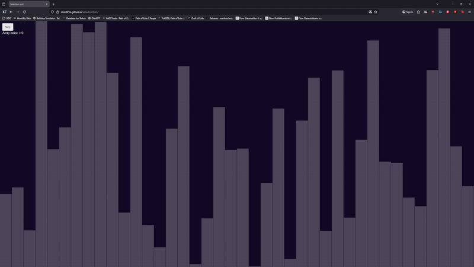

# Selection Sort Visualizer

This project visualizes the **selection sort algorithm** step by step.
Each bar represents a value, and the algorithm places the smallest unsorted
value into its correct position on every click of the button.

## Live Demo
https://montif16.github.io/selectionSort/

## How it works (for non-technical readers)
- Each bar is a random number.
- The green area on the left is the bars and went through the sorting and are now correctly sorted.
- On each step, the smallest remaining bar is selected and moved to its correct position.
- Pressing the **Step** button advances the algorithm one step at a time.

## Algorithm
Selection sort works by repeatedly finding the smallest element in the unsorted
part of the array and swapping it into the first position of the unsorted part of the array, 
then marking it sorted and continuing onward to find the next smallest part of the unsorted array.

## Technologies
- HTML
- JavaScript
- HTML Canvas

## Info

Navn: Lukas Kjellerup Simonsen

Fag: Datastrukturer og algoritmer, E25

Repo: https://github.com/montif16/selectionSort

Deploy: https://montif16.github.io/selectionSort

